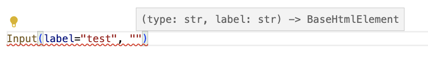
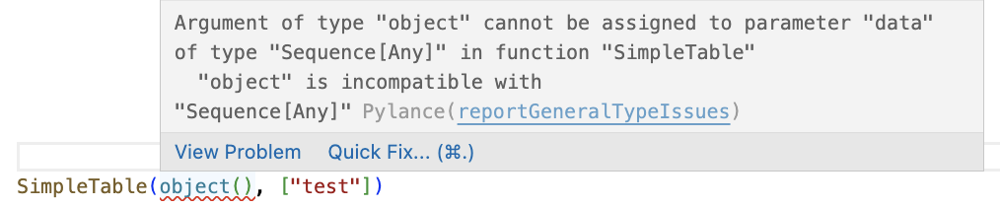

# Background

## The current way

Building web apps these days is difficult. 
Either you go for the full Single Page App (SPA) way and then you need 2 apps, multiple languages and difficult synchronisation problems.
Or you can use one of the other really cool Python apps and templating languages such as Jinja or Django.

However, even in Jinja and Django, you write pure HTML. 
This is fine as long as you are creating HTML. However, once you need to interpolate Python object, you lose all your Python goodies. 
You don't have editor autocomplete, type checking, standard python functions etc. 

Additionally, modern web apps have learned us that reusable components are a good idea. 
Write something once, use it multiple times. 
Change it once and your whole app is updated! While SPA's have this, in Jinja and Django this is more difficult. 
And this is used again in HTML with more difficult access to autocomplete and readability.

## HTML Elements

Enter HTML Elements. 

Why create HTML and interpolate Python object in it if we can create Python and format the HTML afterwards. 
Because we stay in Python, we have access to all Python goodies. 

### Components

Using components we can reuse our code. Because every web page is or wants to be unique, the library does not provide a components itself.
It is up to you to create them. 
Or alternatively you can just remake them from an existing component library by looking into their HTML (don't tell the I sent you.)

For example, making an Input element with label, using the excellent [Bulma framework](https://bulma.io).

```python
from html_elements import elements as e

def Input(type: str, label: str) -> e.BaseHtmlElement:
    display = label.title()
    return e.Div(
        [
            e.Label([display], classes=["label"]),
            e.Div(
                [
                    e.Input(classes=["input"], type=type, placeholder=display, name=label),
                ],
                classes=["control"],
            ),
        ]
    )
```

It creates multiple HTML elements, but we only need to provide 2 input values. 
This means we can simplify our code quite a bit.

Even if we make this a lot more complex, with the right defaults, we can still make it easy to implement with smart defaults. This way we can make the default easy, while making the complex possible.

```python
def Input(type: str, name: str, label: str = "", placeholder: str = "", classes: list[str] = None) -> e.BaseHtmlElement:
    if not label:
        label = name.title()
    if not placeholder:
        placeholder = label
    if not classes:
        classes = ["control"]
    ...
```

### Editor support and linting

When we create functions, we can type them and set the arguments, keyword arguments  which our editors understand. Our editor will then show us what is there.

VS code shows the following



We can even use Python objects for inputs of our components, which can smartly take the information from it.

```python
from typing import Any, List, Sequence
from html_elements import elements as e

def SimpleTable(data: Sequence[Any], columns: Sequence[str]) -> e.BaseHtmlElement:
    rows: List[e.BaseHtmlElement] = []
    for item in data:
        cells: List[e.BaseHtmlElement | str] = []
        for field in columns:
            cells.append(e.Td([getattr(item, field, "")]))
        rows.append(e.Tr(cells))
    return e.Table([e.Thead([e.Tr([e.Th([heading]) for heading in columns])]), *rows], classes=["table"])

data = [
    {"id": "1", "name": "Bobby Greenfield", "email": "bobby@greenfield.com"},
    {"id": "2", "name": "Johnny Smith", "email": "johhnySmith@gmail.com"},
    {"id": "3", "name": "Faith Dogman", "email": "faith.dogman@hotmail.com"},
    {"id": "4", "name": "Gregory House", "email": "greg.house@on.tv"},
]
table = SimpleTable(data, ["id", "name", "email"])
table.to_html()
```

If we would provide not a list or a sequence, it would provide an error.

```python
# Continued from last one
SimpleTable(object(), ["test"])
```

It provides the following error in VS code



And running a type checker like mypy provides the following error.

```bash
docs/examples.py:31: error: Argument 1 to "SimpleTable" has incompatible type "object"; expected "Sequence[Any]"  [arg-type]
```

This is an improvement over Jinja and Django, which do not understand input values or python typing. 
It makes our lives easier by helping us out while developing. 
And it prevents us from making errors by catching input and typing errors when linting.